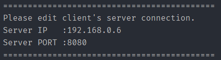
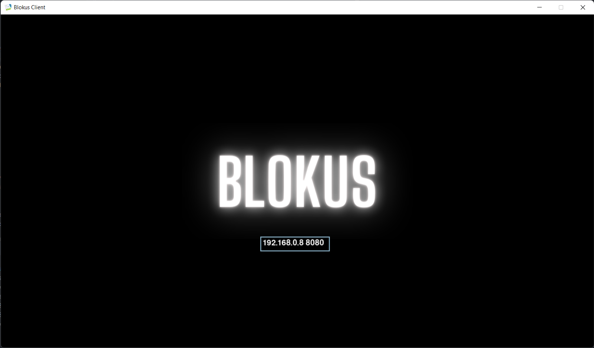
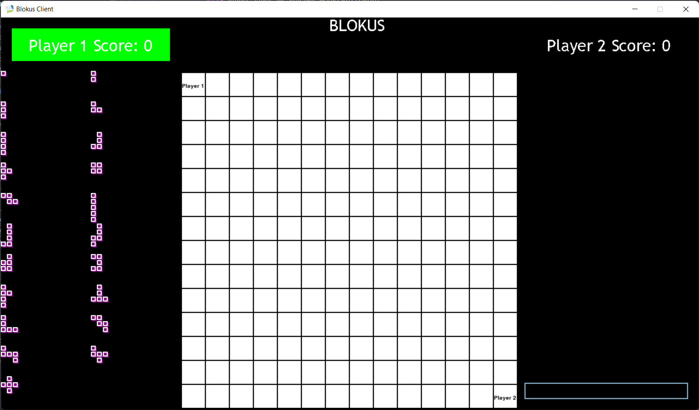

# Final Project - Blokus

### cara menjalankan Blokus:
- prasyarat:
  - Python 3.7
  - pygame `pip install pygame`
  - NumPy `pip install numpy`
  - clone repository dan change directory ke repository
```
git clone https://github.com/jasandgun/fp-progjar-blokus.git
cd fp-progjar-blokus
```
- menjalankan program:
```
# jalankan server di sebuah instance terminal
python src/server.py

# jalankan client di dua buah instance terminal
python src/blokus.py
```
### Setup IP:
- perhatikan server IP dan PORT pada terminal server:

  
- input IP dan PORT dalam text box pada masing-masing client dengan format `[IP_ADDRESS][spasi][PORT]`
  
- tekan enter untuk memulai Blokus (contoh Player 1):
  